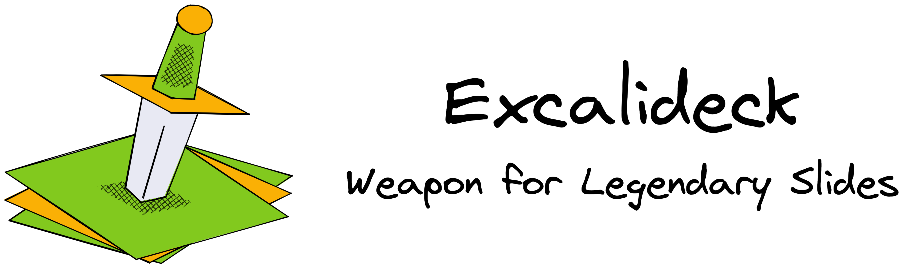

    

**Excalideck** is an app for authoring slide decks that look hand-drawn. **draw
deck** uses [Excalidraw](https://Excalidraw.com/) as the tool for drawing
individual slides. **Excalideck** is low-tech - i.e. not very sophisticated -
and doesn't offer advanced features like transitions, animations, speaker notes,
etc.

## Panes and views

The UI of **Excalideck** consists of two panes: the drawing pane (left) and the
control pane (right). Two **views** (modes, in the Vim sense) - slides and
settings - determine the content of the panes.

The drawing pane contains the Excalidraw interface and allows the user to draw.

The control pane contains buttons for basic deck operations (open, save,
export), a switcher to switch between views, and other content dependent on the
active view.

## Slides view

### Control pane

The controls pane displays a list of miniatures of the slides in the deck. A
miniature contains a "miniature rendering" of a slide, which updates as the user
updates the slide. A miniature supports the following user interactions:

- left-click to select the slide for editing
- drag and drop to rearrange the slide in the deck

The miniature of the selected slide has a visual clue (highlighted border) to
show the user which slide is selected. The miniatures of "skipped" slides have a
visual clue (fade + icon) to show the user which slides are skipped.

The control pane also contains buttons to:

- add a slide to the deck
- delete the slide
- mark the slide to be skipped when presenting / exporting
- include or not the common elements of the deck

### Drawing pane

The drawing pane displays the content of the selected slide and allows the user
to edit it.

The drawing pane also displays a non-printable rectangle marking the perimeter
of the printable page. When the user exports or presents the deck, only the
content inside this rectangle is shown / exported. The user can still draw in
the area outside this perimeter, using it as a scratchpad.

## Settings view

### Control pane

The controls pane displays controls for general settings of the deck. Currently,
the app only offers a control for the aspect ratio of the printable page.

When the user changes the aspect ratio of the printable page, the non-printable
rectangle in the drawing pane changes to the new aspect ratio. The content of
the slides or of the common elements is not modified, so the user has to - if
necessary - move elements around to fit the new printable page.

### Drawing pane

The drawing pane allows to draw a set of common elements that will be included
in all slides (that are configured to include them).

As in slides view, the drawing pane also displays a non-printable rectangle
marking the perimeter of the printable page.
