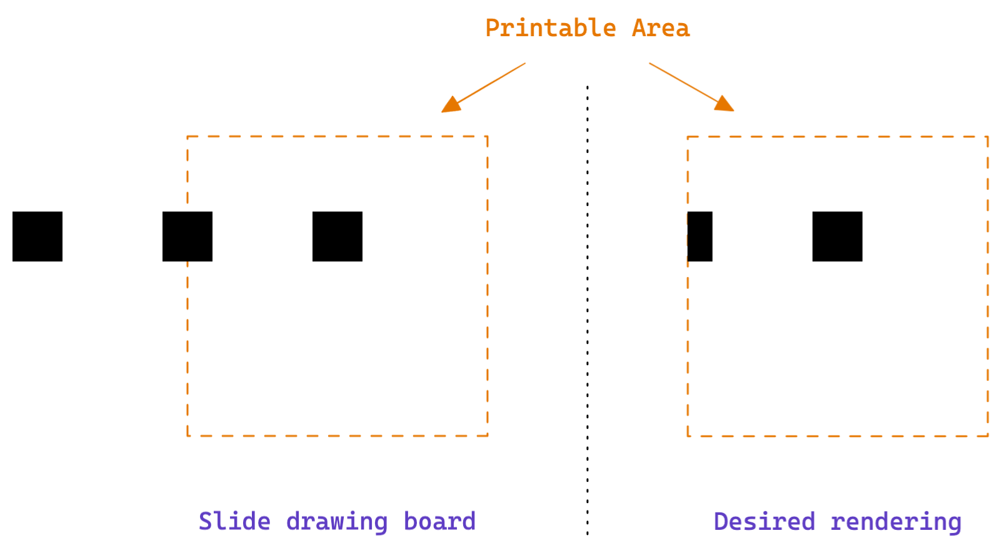
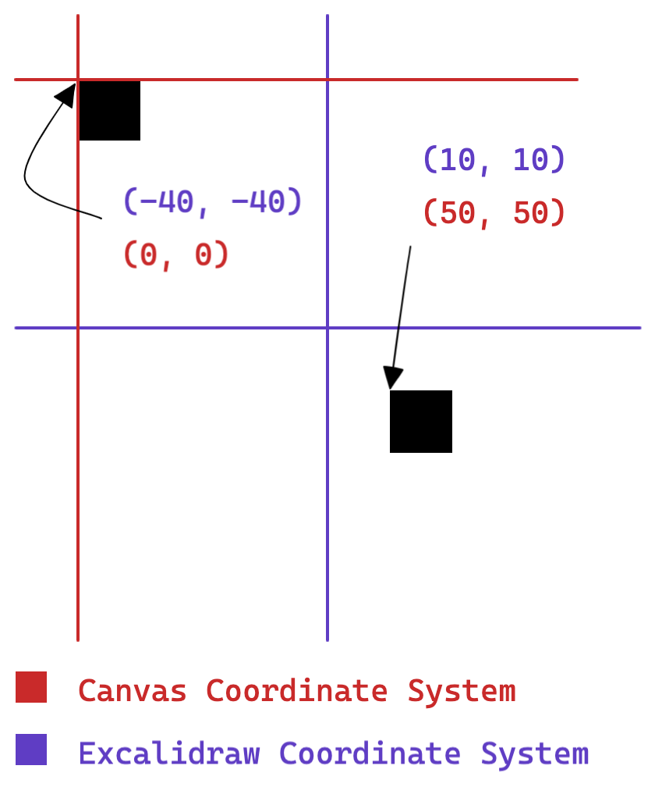
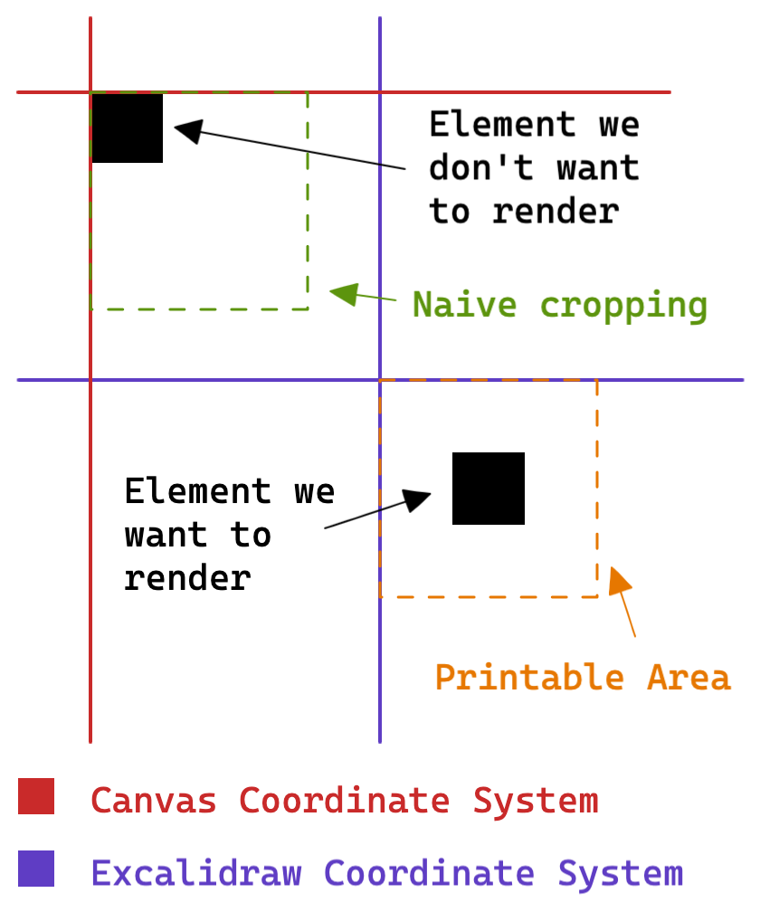
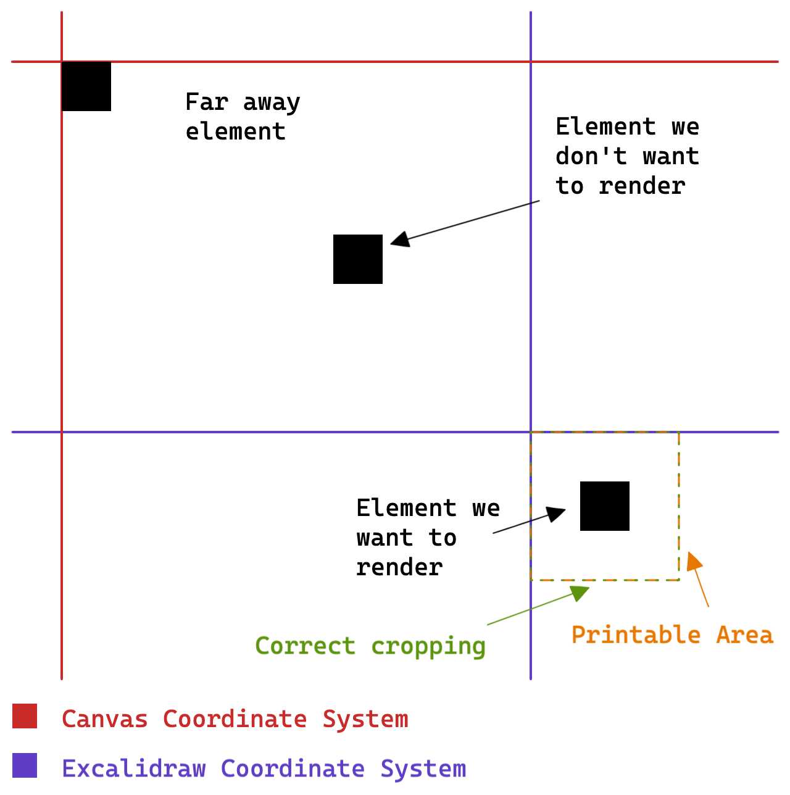

# How `canvasSlideRenderer` works

## Goal

When rendering a slide, we want to render only the Excalidraw elements lying
inside the printable area of the slide. For elements lying partially inside and
partially outside of the printable area, we only want to render the portion
inside the printable area.

## Approach

First, render all Excalidraw elements to a canvas. Then, crop the canvas to the
printable area.

### Difficulty

The main difficulty with this approach is identifying **where** the printable
area is located inside the canvas. This is because the `exportToCanvas` function
produces a canvas with a coordinate system where `(0, 0)` is assigned to the
top-left-most point of the set of rendered Excalidraw elements.

So, given that the printable area is set to have Excalidraw-coordinates
`(0, 0, printableArea.width, printableArea.height)`, naively cropping the canvas
to those same coordinates wouldn't produce the desired effect.

### Solution

The chosen way to overcome this difficulty is to add a "far away" Excalidraw
element, a small rectangle whose top-left-most point is _most likely_ above and
more-to-the-left any other element. Knowing the Excalidraw-coordinates of this
rectangle, and knowing that its top-left-most point will _most likely_ have
canvas-coordinates `(0,0)`, we can then figure out the correct cropping area.

